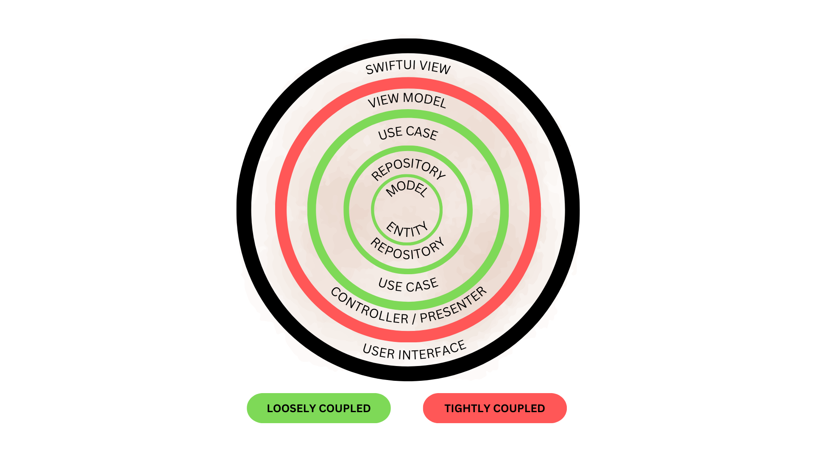

# Clean Architecture example usage using SwiftUI

## Table of Contents
1. [Introduction](#introduction)
2. [Architecture Overview](#architecture-overview)
3. [Project Structure](#project-structure)
4. [Getting Started](#getting-started)
5. [Technologies Used](#technologies-used)
6. [Usage](#usage)
7. [Contributing](#contributing)
8. [License](#license)

## Introduction

This project demonstrates the implementation of Clean Architecture in a SwiftUI app, showcasing separation of concerns and clear organization into layers. The app fetches top-rated movies from the [Movie Database API](https://www.themoviedb.org/documentation/api) and allows users to mark favorite movies, which are stored persistently.
## Architecture Overview

The project follows Clean Architecture principles:
- **Domain Layer**: Contains protocols for the use case and repository.
- **Data Layer**: Implements the repository to fetch data from the API.
- **Presentation Layer**: SwiftUI views and view models handle the UI and user interaction logic.

### Data Flow:
```
[View (SwiftUI)] 
    ↕ (via ViewModel)
[Use Case] 
    ↕ (via Repository Protocol)
[Repository] 
    ↕ (via API Request)
[Movie Database API]
```

## Project Structure

```
CleanArchitectureExample/
│
├── Protocols/
│   ├── UseCase/
│   │   └── GetTopRatedMoviesUseCaseProtocol.swift
│   └── Repository/
│       └── MovieRepositoryProtocol.swift
│
├── UseCase/
│   └── GetTopRatedMoviesUseCase.swift
│
├── Repository/
│   └── MovieRepository.swift
│
├── ViewModels/
│   └── MoviesViewModel.swift
│
├── Views/
│   ├── MoviesView.swift
│   └── FavoritesView.swift
│
├── Entities/
│   └── Movie.swift
│
├── Config.xcconfig (not included)
└── Resources/
    └── Assets/
```

### Layers Explained


- **Protocols**: Define the interfaces for the Use Case and Repository.
- **Use Case**: Implements the business logic for fetching top-rated movies from the API.
- **Repository**: Interacts with the Movie Database API to fetch the movie data.
- **ViewModels**: Handle the UI logic and interact with the Use Case.
- **Views**: SwiftUI views displaying movies and favorites.
- **Entities**: Data models representing movie objects.

## Getting Started

### Prerequisites

- Xcode 14+
- Swift 5.7+
- API Key for [Movie Database API](https://developer.themoviedb.org/docs/getting-started).

### Installation

1. Clone the repository:

   ```bash
   git clone https://github.com/your-username/CleanArchitectureExample.git
   cd CleanArchitectureExample
   ```

2. Add the `Config.xcconfig` file:

   After cloning, create a `Config.xcconfig` file in the project and add your API key:

   ```plaintext
   API_KEY = YOUR_API_KEY_HERE
   ```

   Replace `YOUR_API_KEY_HERE` with your actual API key from [themoviedb.org](https://www.themoviedb.org/documentation/api).

3. Open the project in Xcode:

   ```bash
   open CleanArchitectureExample.xcodeproj
   ```

4. Build and run the project:

    - Select a target device.
    - Press `Cmd + R` or click the Run button in Xcode.

## Technologies Used

- **SwiftUI**: For building UI components.
- **Combine**: For managing asynchronous data streams.
- **Clean Architecture**: To organize the app’s layers.
- **Movie Database API**: To fetch top-rated movies.

## Usage

Once the app is running, it will display two tabs:
1. **Movies Tab**: Lists all top-rated movies fetched from the Movie Database API. You can select a movie to mark it as a favorite.
2. **Favorites Tab**: Displays only the movies you marked as favorites.

### Persistent Favorites

Favorites are stored in a persistent variable, ensuring that user preferences are retained even after the app is closed.

## Contributing

Contributions are welcome! If you would like to contribute, please open a pull request or file an issue.

## License

This project is licensed under the MIT License.
